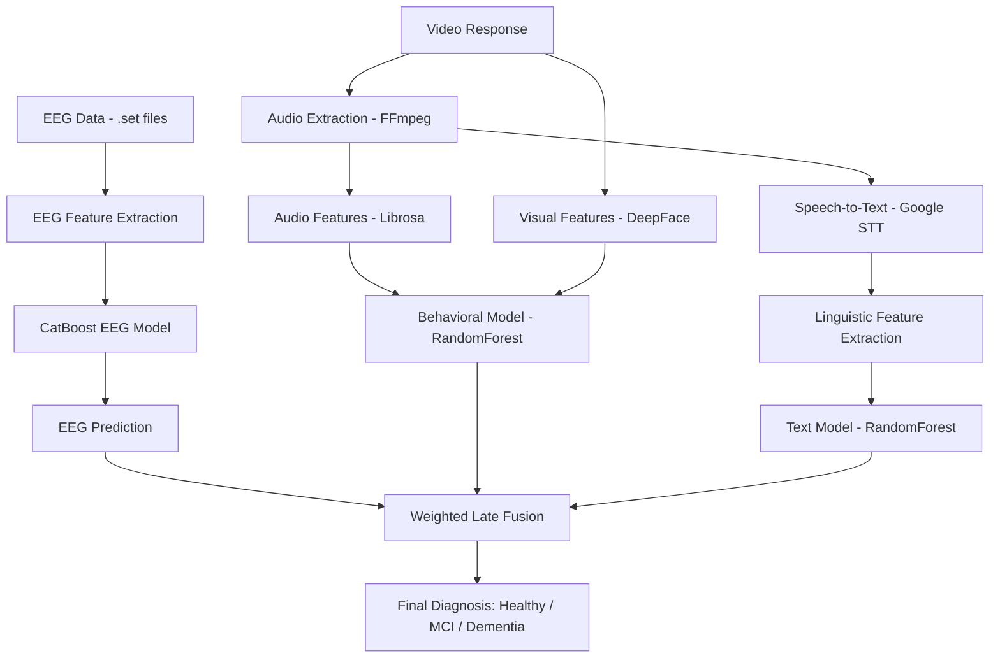

<div align="center">

# 🧠 NeuroCognitiveAI

### Multimodal Mild Cognitive Impairment Detection using EEG and Behavioral Signals

**An AI-driven diagnostic system that integrates EEG brain signals, facial behavior, speech, and audio cues to detect Mild Cognitive Impairment (MCI) and early-stage dementia.**
*Combining neuroscience, machine learning, and multimodal AI for early cognitive disorder detection.*

<br>

[](https://www.python.org/)
[](https://streamlit.io/)
[](https://catboost.ai/)
[](https://github.com/serengil/deepface)
[](https://librosa.org/)
[](https://scikit-learn.org/)
[]()

</div>

---

# 📖 What is NeuroCognitiveAI?

NeuroCognitiveAI is a **multimodal artificial intelligence system designed for early detection of Mild Cognitive Impairment (MCI) and dementia-related disorders**.

Traditional diagnosis of cognitive decline relies on **subjective cognitive tests and time-consuming neurological examinations**. This system automates cognitive evaluation by analyzing **brain activity, facial behavior, speech characteristics, and linguistic patterns**.

The system integrates three major modalities:

* **EEG Brain Signals**
* **Behavioral Visual & Audio Features**
* **Speech-Linguistic Analysis**

These modalities are combined using a **weighted late-fusion model**, producing a robust cognitive diagnosis.

---

# ✨ Features

| Feature                                | Description                                             |
| -------------------------------------- | ------------------------------------------------------- |
| 🧠 **EEG Analysis**                    | Extracts Delta, Theta, Alpha, Beta, Gamma band features |
| 🤖 **CatBoost EEG Model**              | Classifies brain signal patterns                        |
| 🎥 **Facial Emotion Analysis**         | Detects facial emotions using DeepFace                  |
| 🔊 **Audio Feature Extraction**        | MFCC, pause patterns, RMS energy                        |
| 🗣 **Speech-to-Text Analysis**         | Extracts linguistic features from spoken responses      |
| ⚖️ **Weighted Late Fusion Model**      | Combines EEG, behavioral, and textual predictions       |
| 📊 **Interactive Streamlit Dashboard** | Visualizes results and probability distributions        |

---

# 🏗️ System Architecture



---

# 🧬 Dataset

The EEG dataset used is publicly available on **OpenNeuro**.

🔗 [https://openneuro.org/datasets/ds004504/versions/1.0.8](https://openneuro.org/datasets/ds004504/versions/1.0.8)

| Attribute     | Details                                               |
| ------------- | ----------------------------------------------------- |
| Subjects      | 88                                                    |
| Groups        | Healthy, Alzheimer’s Disease, Frontotemporal Dementia |
| Format        | EEGLAB `.set` files                                   |
| Sampling Rate | 512 Hz                                                |

Behavioral datasets were collected through simulated **cognitive interview prompts** with video and audio recordings.

---

# 🛠️ Technology Stack

### Core AI & ML

| Component           | Technology               |
| ------------------- | ------------------------ |
| EEG Processing      | `MNE`                    |
| EEG Model           | `CatBoost`               |
| Behavioral Model    | `RandomForest`           |
| Text Model          | `RandomForest`           |
| Feature Engineering | `NumPy`, `Pandas`        |
| Model Utilities     | `Scikit-learn`, `Joblib` |

---

### Behavioral & Signal Processing

| Component          | Technology          |
| ------------------ | ------------------- |
| Facial Analysis    | `DeepFace`          |
| Audio Features     | `Librosa`           |
| Speech Recognition | `SpeechRecognition` |
| Video Processing   | `OpenCV`            |
| Audio Extraction   | `FFmpeg`            |

---

### Interface

| Component     | Technology       |
| ------------- | ---------------- |
| UI Framework  | `Streamlit`      |
| Visualization | Streamlit charts |

---

# 📂 Project Structure

```text
Multimodal-MCI-Detection/
│
├── final.py                     # Main Streamlit application
├── eeg_feature_extractor.py     # EEG feature extraction pipeline
├── eeg_model_check.ipynb        # Model experimentation notebook
│
├── features.csv                 # Extracted EEG features
├── participants.tsv             # Subject labels
├── catboost_eeg_model.cbm       # Trained EEG classifier
│
└── README.md
```

---

# 🚀 Installation & Setup

### Prerequisites

* Python 3.10+
* FFmpeg installed

---

## 1️⃣ Install Dependencies

```bash
pip install -r requirements.txt
```

Main libraries include:

* streamlit
* mne
* catboost
* deepface
* librosa
* speechrecognition
* opencv-python
* scikit-learn
* pandas
* numpy

---

## 2️⃣ Install FFmpeg

**Windows**

```bash
choco install ffmpeg
```

**Linux**

```bash
sudo apt install ffmpeg
```

**macOS**

```bash
brew install ffmpeg
```

---

# 🏃 Running the Application

Launch the Streamlit dashboard:

```bash
streamlit run final.py
```

Access the interface at:

```
http://localhost:8501
```

---

# ⚙️ How It Works

### 🧠 Phase 1 — EEG Analysis

1. Upload EEG `.set` file
2. Extract bandpower features for:

* Delta
* Theta
* Alpha
* Beta
* Gamma

3. Features fed into **CatBoost classifier**

---

### 🎥 Phase 2 — Behavioral Analysis

Participant responds to cognitive prompts.

Processing pipeline:

* Video analyzed via **DeepFace**
* Audio features extracted using **Librosa**
* Speech converted to text using **Google STT**
* Linguistic metrics computed

---

### ⚖️ Phase 3 — Multimodal Fusion

Predictions from:

* EEG model
* Behavioral model
* Text model

are combined using **weighted late fusion**.

Final probabilities generated for:

* Healthy
* Mild Cognitive Impairment
* Dementia

---

# 📊 Results & Observations

| Model            | Accuracy | F1 Score | ROC-AUC  |
| ---------------- | -------- | -------- | -------- |
| EEG (CatBoost)   | ~89%     | 0.86     | 0.92     |
| Behavioral (RF)  | ~82%     | 0.80     | 0.87     |
| Text (RF)        | ~78%     | 0.76     | 0.84     |
| **Fusion Model** | **92%**  | **0.90** | **0.95** |

The **multimodal fusion model significantly improved prediction stability and accuracy**.

---

# 🖥️ UI Overview

The **Streamlit dashboard** includes:

* EEG upload interface
* Feature visualization
* Video/audio upload
* Real-time transcription
* Emotion detection display
* Probability bar charts for final diagnosis

---

# 🔮 Future Improvements

* Integration with **OpenBCI real-time EEG acquisition**
* Expand dataset for **MCI-specific EEG patterns**
* Replace feature engineering with **deep neural encoders**
* Implement **cross-modal attention transformers**
* Deploy as a **clinical decision support tool**

---

# 👨‍💻 Contributors

**Kishore P**
CSE (AI & Robotics)
VIT Chennai

Collaborators:

* Srinidhi Kalivemula
* Amara Sree

---

# 📜 License

This project is released under the **MIT License**.

---

# 📚 Citation

If you use this work in academic research, please cite:

```
P. Kishore et al.,
"Multimodal Mild Cognitive Impairment Detection using EEG and Behavioral Cues",
VIT Chennai, 2025.
```

---

<div align="center">

<br>

<i>Advancing early cognitive disorder detection through multimodal artificial intelligence.</i>

<br><br>

**NeuroCognitiveAI** — bridging neuroscience and AI diagnostics.

</div>
